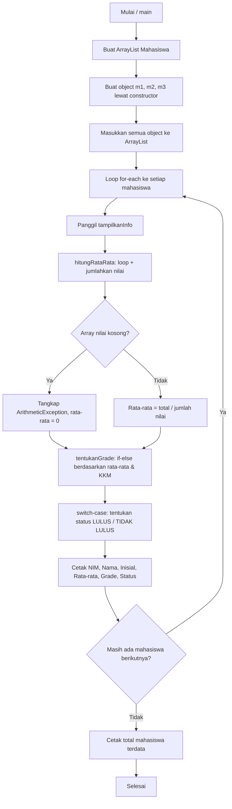

# Program Java: Data Mahasiswa

Program sederhana berbasis Java (OOP) yang mengelola data mahasiswa: menghitung rata-rata nilai ujian, menentukan grade, dan status kelulusan.

---

## Tema

Studi kasus yang dipilih adalah **Data Mahasiswa**. Setiap mahasiswa memiliki:

- **NIM** — nomor induk mahasiswa
- **Nama**
- **Nilai ujian** (bisa lebih dari satu, disimpan dalam array)

Dari data tersebut, program akan:

1. Menghitung **rata-rata** nilai ujian.
2. Menentukan **grade** (A/B/C/E) berdasarkan rata-rata.
3. Menentukan **status kelulusan** (LULUS / TIDAK LULUS) berdasarkan grade.
4. Menampilkan seluruh informasi ke layar untuk setiap mahasiswa dalam daftar.

Tema ini dipilih karena secara alami mencakup kebutuhan OOP dasar: ada data (atribut), ada aturan pengambilan keputusan (grade & kelulusan), ada kumpulan data (banyak mahasiswa), dan ada potensi error nyata (nilai kosong → pembagian oleh nol).

---

## Struktur Program

```
DataMahasiswa.java
├── class Mahasiswa        → menyimpan data & logika satu mahasiswa
│   ├── atribut: nim, nama, nilaiUjian[]
│   ├── konstanta: KKM = 60
│   ├── constructor: Mahasiswa(nim, nama, nilaiUjian)
│   ├── method: hitungRataRata()
│   ├── method: tentukanGrade(rataRata)
│   └── method: tampilkanInfo()
│
└── class DataMahasiswa (main)
    ├── membuat ArrayList<Mahasiswa>
    ├── membuat object m1, m2, m3
    └── looping untuk menampilkan info setiap mahasiswa
```

---

## Alur Program



**Penjelasan singkat alur:**

1. Program membuat 3 object `Mahasiswa` dengan data berbeda, lalu memasukkannya ke `ArrayList`.
2. Program melakukan perulangan (`for-each`) ke setiap mahasiswa dalam daftar.
3. Untuk setiap mahasiswa, dihitung rata-rata nilai. Jika array nilai kosong, `try-catch` menangkap `ArithmeticException` agar program tidak berhenti paksa.
4. Rata-rata dipakai untuk menentukan **grade** (if-else) dan **status kelulusan** (switch-case).
5. Semua informasi dicetak ke layar, lalu program lanjut ke mahasiswa berikutnya hingga daftar habis.
6. Di akhir, total jumlah mahasiswa yang terdata ikut dicetak.

---

## Cara Menjalankan

```bash
javac DataMahasiswa.java
java DataMahasiswa
```

---

## Contoh Output Program
```
========== LAPORAN DATA MAHASISWA ==========
----------------------------------------
NIM         : A11.2023.001
Nama        : BUDI SANTOSO (panjang nama: 12 huruf)
Inisial     : B
Rata-rata   : 81.0
Grade       : B
KKM         : 60
Status      : LULUS
----------------------------------------
NIM         : A11.2023.002
Nama        : CITRA DEWI (panjang nama: 10 huruf)
Inisial     : c
Rata-rata   : 57.0
Grade       : E
KKM         : 60
Status      : TIDAK LULUS
Terjadi error: / by zero (data nilai kosong)
----------------------------------------
NIM         : A11.2023.003
Nama        : RIAN PRATAMA (panjang nama: 12 huruf)
Inisial     : R
Rata-rata   : 0.0
Grade       : E
KKM         : 60
Status      : TIDAK LULUS
----------------------------------------
Total mahasiswa terdata: 3
```

**Catatan hasil:**
- `m1` (Budi) lulus dengan grade **B**.
- `m2` (Citra) tidak lulus karena rata-rata 57 di bawah KKM (60).
- `m3` (Rian) sengaja diberi data nilai kosong untuk menguji **exception handling** — pesan error `ArithmeticException` ("/ by zero") tertangkap oleh `try-catch` sehingga program tetap berjalan normal, dengan rata-rata di-default menjadi 0.

---

## Poin Materi yang Terpenuhi

| No | Poin | Implementasi |
|----|------|--------------|
| 1 | Class & Object | `class Mahasiswa` dengan 3 method |
| 2 | Constructor | `Mahasiswa(nim, nama, nilaiUjian)` |
| 3 | Konstanta | `static final int KKM = 60` |
| 4 | Kondisional | `if-else` (grade) & `switch-case` (status) |
| 5 | Looping | `for` (jumlah nilai) & `for-each` (daftar mahasiswa) |
| 6 | Exception Handling | `try-catch (ArithmeticException e)` |
| 7 | Char & String | `char grade`, `toUpperCase()`, `length()`, `substring()` |
| 8 | Array / Collection | `int[] nilaiUjian`, `ArrayList<Mahasiswa>` |
| 9 | Object & Output | `m1`, `m2`, `m3` ditampilkan via `System.out.println` |

---

## Identitas Lab Session 1
**Mata Kuliah:** Pemrograman Berorientasi Objek<br>
**Lab Session:** 01<br>
**Materi:** Implementasi Class, Constructor, Looping, dan Exception Handling dalam Java: Studi Kasus Data Mahasiswa<br>
**Nama:** Nabila Salma Az Zahra<br>
**NIM:** L0325031<br>
**Asisten Praktikum:** Hammam Ibnu Adi Abdillah<br>
**NIM Asisten:** L0324015<br>
**Asisten Praktikum:** Muhammad Ihsaan Al Fikri<br>
**NIM Asisten:** L0324024<br>
**Program Studi:** Informatika PSDKU Kebumen<br>
**Universitas:** Universitas Sebelas Maret<br>
**Tahun:** 2026<br>
